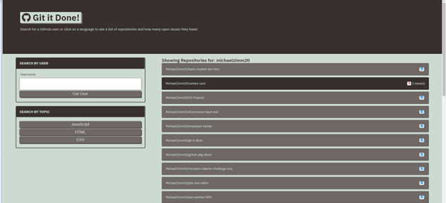
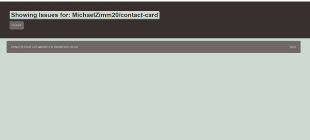
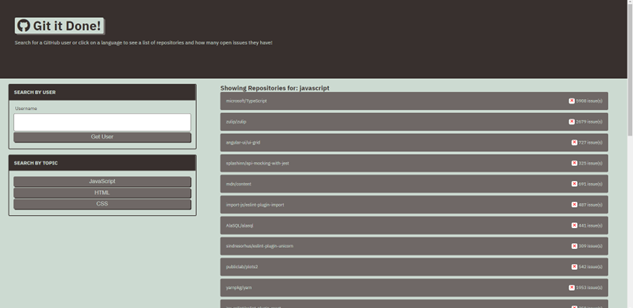

# git-it-done

## Description
  Git It Done, is a web application that will search GitHub for open source projects with open issues and pull requests. It will then display these Github repositories, users also have the functionality to search for specifics like: user or topic (JS,  HTML, CSS)

  Utilizing JavaScript, HMTL, CSS, Fetch API, Server-Side API, receive/parse JSON, dynamically generate HTML, handle response codes.

## Table of Contents 
  * [Installation](#installation)
  * [Usage](#usage)
  * [Important-Links](#Important-Links)
  * [Questions](#questions)

  ## Installation
  * Ensure you are in your root folder,then open terminal and clone code from github. Then run these in the command terminal:

  * Next, create a new `.gitignore` and add DS_Store to it 
  * Use the respective API call links to allow the fetch request to target the right data
  

   ## Usage 
  * Open `index.html` in a web browser 
  * Test out the application funcanality by searching by user and/or topic.
  * click on any repository with open or closed issues or request. Once user clicks on that specific they can proceed to click on the specific issue or request and will be linked to the actual github URL.
  

  

   

   
 
   
 
   

 ## Important Links 
* GitHub Link: https://github.com/MichaelZimm20/git-it-done
* Live Deployed Link: https://michaelzimm20.github.io/git-it-done/

## Questions 
  If you have any questions or concerns, contact:
  * GitHub: [MichaelZimm20](https://github.com/MichaelZimm20)